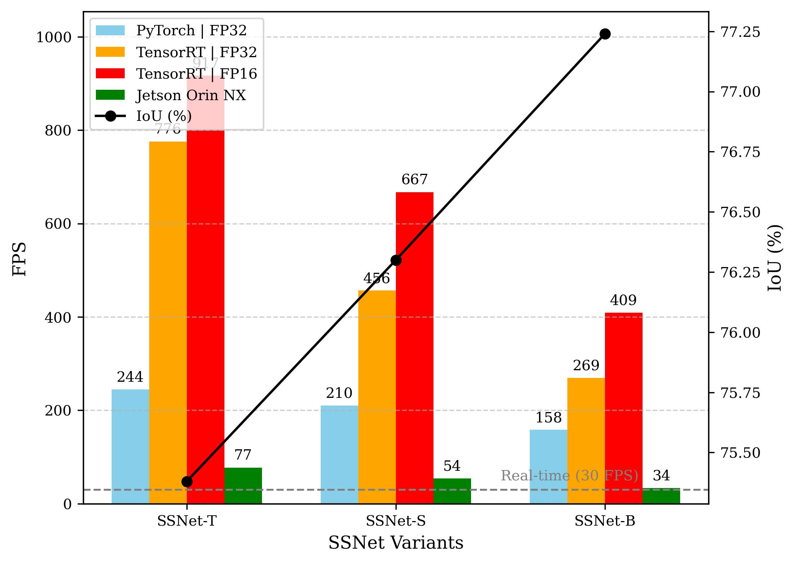

# SSNet: Semantic‑Aware Skip Connections for Real‑Time Pavement Crack Segmentation

Semantic‑aware skip connections with dynamic kernel adaptation for accurate, real‑time crack segmentation across diverse road scenes. The repository contains training, evaluation, and utilities for reproducible experiments.

<p align="center">
  
</p>

## Highlights
- Real‑time segmentation with lightweight SSNet variants (T, S, B)
- Semantic‑aware skip connections and dynamic kernels for fine crack details
- Reproducible pipelines for training, evaluation, and cross‑dataset testing
- Optional experiment tracking via Weights & Biases and TensorBoard

## Project Structure
```
SSNet/
├── checkpoints/         Saved model weights
├── config.py            Central configuration for datasets, models, training
├── datasets/            Dataset loader classes
├── data/                Root directory for datasets (e.g., DeepCrack/)
├── models/              Model architecture definitions
├── results/             Training logs, plots, and evaluation summaries
├── utils/               Helper utilities (metrics, figures, losses)
├── train.py             Main training script
├── test.py              Main evaluation script
└── requirements.txt     Python dependencies
```

## Getting Started
1) Clone the repository
```
git clone <your-repo-url>
cd SSNet
```
2) Install dependencies (recommended: virtual environment)
```
pip install -r requirements.txt
```
3) Optional: enable Weights & Biases
```
wandb login
```
W&B can be turned on/off in `config.py`.

## Configuration
All experiments are controlled from `config.py`. Before running:
- Dataset paths: update `DATASETS[<name>]['base_dir']` to your local paths
- Experiment tracking: set `WANDB['ENABLE']` and `WANDB['PROJECT']`
- Training defaults: `TRAIN['MODELS_TO_RUN']`, `TRAIN['GPU_IDS']`, `TRAIN['BATCH_SIZE']`, `TRAIN['EPOCHS']`

## Dataset Preparation
Folder layout expected per dataset:
```
data/{DatasetName}/
├── images/
│   ├── image1.jpg
│   └── image2.png
└── masks/
    ├── image1.png
    └── image2.png
```
- Splits: provide `train.txt`, `val.txt`, and `test.txt` at the dataset `base_dir`, each listing image filenames (one per line). See `create_and_rename.py` for automation ideas.
- Normalization: use `compute_normalize.py` to compute per‑dataset mean/std and update `config.py`.

## Training
Train one or more models on specified GPUs.
```
# Train a single model on GPU 0
python train.py --dataset CFD --models SSNet_T --gpu_ids 0

# Train multiple models on GPUs 0 and 1
python train.py --dataset Crack500 --models SSNet_S U_Net UNetPlus --gpu_ids 0 1

# Train all models defined in config.py on default GPUs
python train.py --dataset CFD --models all
```

## Evaluation
Evaluate checkpoints with `test.py` by specifying the training dataset (to find the right checkpoints) and the datasets to test on.
```
# In‑domain evaluation (trained and tested on CFD)
python test.py --train_dataset CFD --test_datasets CFD --models SSNet_T --gpu_ids 0

# Cross‑dataset evaluation (trained on DeepCrack, tested on Crack500 and GAPs300)
python test.py --train_dataset DeepCrack --test_datasets Crack500 GAPs300 --models SSNet_S
```

## Visualizations and Performance
<p align="center">
  
</p>

<p align="center">
  
</p>

<p align="center">
  
</p>

## Viewing Results
- Checkpoints: best model weights are saved in `checkpoints/`
- Logs and plots: numerical results, CSV summaries, PR curves, and efficiency plots are saved in `results/`
- TensorBoard:
```
tensorboard --logdir results
```
- Weights & Biases: when enabled, results appear under your W&B project

## License
This project is released under the MIT License. See the LICENSE file for details.
